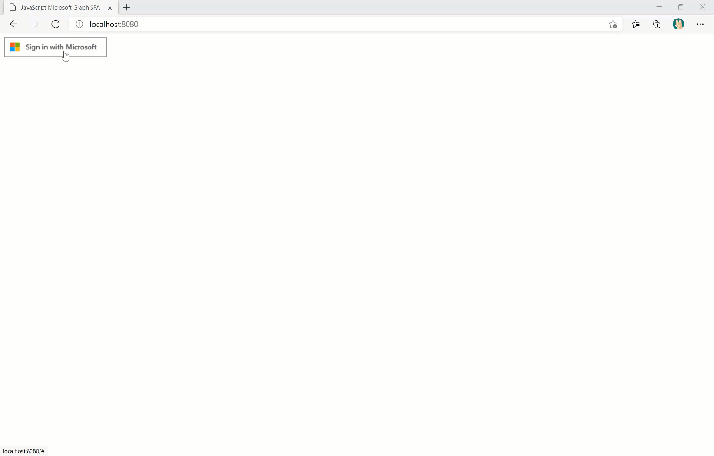

# A JavaScript application to retrieve Microsoft 365 data using Microsoft Graph 🚀

## Prerequisites

- [Node.js](https://nodejs.org/en/)
- [Visual Studio Code](https://code.visualstudio.com/)
- [Microsoft 365 Developer Tenant](https://developer.microsoft.com/en-us/microsoft-365/dev-program)

### Register Azure AD APP

You have to register an application in Azure Active Directory in order to run this application.
You could do it manually in the [Azure Portal](https://portal.azure.com/).

#### Register AAD app Manually in Azure Portal

1. [Register a new application](https://docs.microsoft.com/en-gb/azure/active-directory/develop/scenario-spa-app-registration) in the [Azure Portal](https://portal.azure.com/).
1. Ensure that the application is enabled for the [authorization code flow with PKCE](https://docs.microsoft.com/en-gb/azure/active-directory/develop/v2-oauth2-auth-code-flow). This will require that you redirect URI configured in the portal is of type SPA.
1. For this sample we will create a [single tenant application](https://docs.microsoft.com/en-us/azure/active-directory/develop/single-and-multi-tenant-apps)

### Configure the sample

- copy the value of the `Application (client) ID` of the newly registered application from Azure Portal. You can get this from the overview page of the newly registered application.
- in the `auth.js` file, on line 4, replace the value of the `clientId` property with the copied `Application (client) ID`
- Copying the value of the `Directory (tenant) ID` of the newly registered application from Azure Portal. You can get this from the overview page of the newly registered application.
- in the `auth.js` file, on line 6, replace the value of the `authority` property with the ID of your Azure AD, eg `https://login.microsoftonline.com/0be187e2-aa5c-464a-bc8b-74b0416b4c3a`, since this is a single tenant application.
- In case you created a multi-tenant application then comment out line 6 in `auth.js`. You don't need to pass the authority.

### Run the app

Run below command in the command line after moving to project folder to run the application in browser. The application will open in the port `8080` of localhost by default for npx. The option `-c-1` disables any caching.

```nodejs
npx http-server -c-1
```

